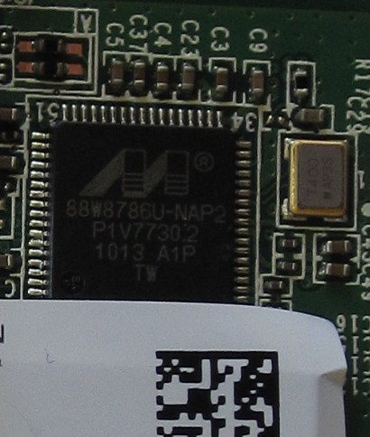

The Xbox 360 use all the same Ethernet 10/100 network adapter.
WiFi-adapter is missing, but can be purchased separately. For new
revisions of consoles (Slim version) Wi-Fi-built module.

Controller chip Fast Ethernet (on-board is usually referred to as U1B1
or
U1B2)

# Ethernet Chip

## ICS1893BF

[Datasheet](https://www.idt.com/document/dst/1893bfbk-datasheet)

Comes from Integrated Circuit Systems, Inc.

## BCM5241

[Datasheet](https://docs.broadcom.com/docs/12358209)

Comes from Integrated Circuit Systems, Inc.

Pinout coming soon...

# WLAN Chip

## 88W8786U-NAP2

Comes from Marvell, Inc.

[Category:Xbox360_Hardware](Category_Xbox360_Hardware)
