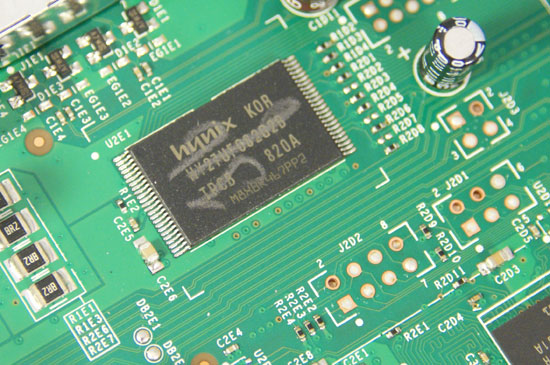
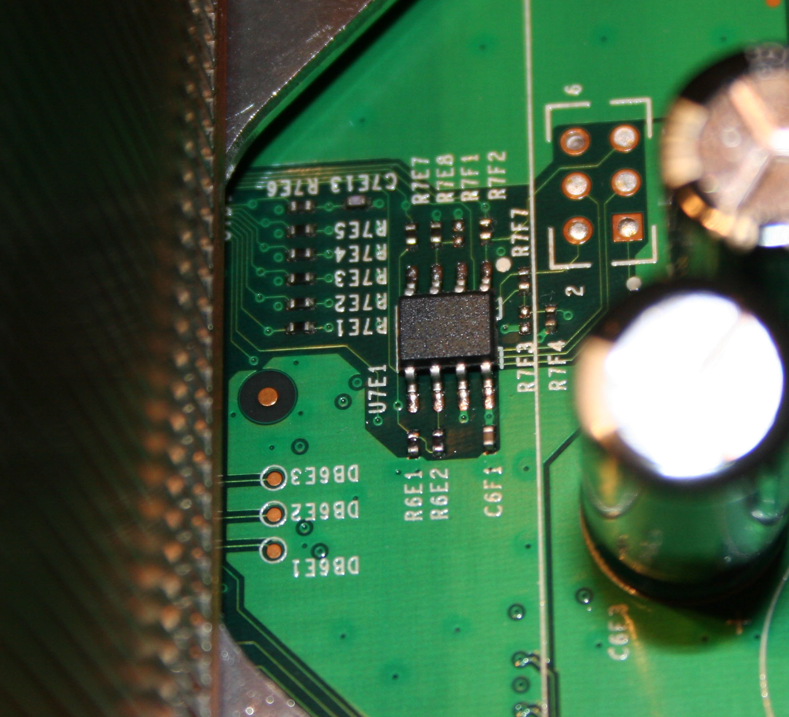

## Flash memory

  - [Datasheet](https://web.archive.org/web/20150112073857/http://www.hynix.com/datasheet/pdf/flash/HY27US(08_16)281A%20Series(Rev0.6).pdf)

<!-- end list -->

  - SMT socket that should work if you choose to remove yours:
    <https://web.archive.org/web/20111206034431/http://www.emulation.com:80/cgi-cfm/insert_quantity.cfm?part_number=S%2DTSO%2DSM%2D048%2DA>,

Attached to [Southbridge](Southbridge.md "wikilink")

## NAND Points on Motherboard for FAT

## NAND Points on Motherboard for SLIM

comming soon

## Different Sizes

On different Motherboard Revision also different NANDs were used.
[Xenon](Xenon "wikilink")-, [Zephyr](Zephyr "wikilink")-,
[Falcon](Falcon "wikilink")-, [Opus](Opus "wikilink")- and some
[Jasper](Jasper "wikilink")-Consoles (Retails) are using 16MB NANDs,
other [Jasper](Jasper "wikilink")-Consoles (Retail),Arcade Bundles which
came without a HDD, got a 256MB or 512MB NAND onboard. Only 64MB of
these 256/512MB NAND are used for system files, the rest is used as an
internal Memory Unit. All Development-/Demo-/Reviewer-/Test-Kits got at
least a 64MB NAND. Depending on the NAND Size either Small- or
Large-Block Flash Controllers get used.

## Flash Controllers

The Flash Controller decides how to handle the NAND Memory. There are
currently two types, the Old/Original SFC which handles the NAND with
small block and the new SFC (Codename: Panda?) which handles the NAND as
either small or large blocks.

**Original SFC (pre-Jasper)**

  - 16MB NAND

| Type                            | Size                   |
| ------------------------------- | ---------------------- |
| Block Size                      | 0x4000 (16KB)          |
| Block Count                     | 0x400                  |
| Page Size                       | 0x200                  |
| Pages per Block                 | Block size / Page size |
| Raw Page Size (incl. SpareData) | 0x210                  |
| Usable Filesystem-Size          | 0x3E0                  |

  - 64MB NAND

| Type                            | Size                   |
| ------------------------------- | ---------------------- |
| Block Size                      | 0x4000 (16KB)          |
| Block Count                     | 0x1000                 |
| Page Size                       | 0x200                  |
| Pages per Block                 | Block size / Page size |
| Raw Page Size (incl. SpareData) | 0x210                  |
| Usable Filesystem-Size          | 0xF80                  |

**New SFC**

  - Small Block: 16MB NAND

| Type                            | Size                   |
| ------------------------------- | ---------------------- |
| Block Size                      | 0x4000 (16KB)          |
| Block Count                     | 0x400                  |
| Page Size                       | 0x200                  |
| Pages per Block                 | Block size / Page size |
| Raw Page Size (incl. SpareData) | 0x210                  |
| Usable Filesystem-Size          | 0x3E0                  |

  - Large Block: 256/512MB NAND

| Type                            | Size                   |
| ------------------------------- | ---------------------- |
| Block Size                      | 0x20000 (128KB)        |
| Block Count (non-MU)            | 0x1000                 |
| Page Size                       | 0x200                  |
| Pages per Block                 | Block size / Page size |
| Raw Page Size (incl. SpareData) | 0x210                  |
| Usable Filesystem-Size          | 0x1E0                  |

## Simple Calculations

Have an address which is without
    ECC?

    realaddr = (addr / 512) * 528 + (realaddr % (mod) 512 > 0 ? realaddr % (mod) 512 : 0);

This also works in
    reverse:

    addr = (realaddr / 528) * 512 + (realaddr % (mod) 528 > 0 ? realaddr % (mod) 528 : 0);

## Reading/Writing

The Flash can be written or read using a number of methods. If you have
the old shader hack running the easiest is using
[lflash](lflash.md "wikilink"). You can also wire LPT directly to the flash
using this
[diagram](http://img19.imageshack.us/img19/5198/wiringforxenondiagram.jpg).
As well, you can build your own USB SPI Flasher with [this
diagram](http://img35.imageshack.us/img35/8949/xbox360usbflasher.png)
and use [these
binaries](http://nds.cmamod.com/x360/PICFLASH_v3b_plus2.zip). Flash the
PicXboot.hex to your PIC, then use the programmer from [this
picflash](http://www.megaupload.com/?d=X6TBNFDC) to flash the
picflash.hex to the PIC through USB in bootloader mode. Once the device
is flashed, you can then install it using the drivers from NandPro or
use TeamXecuters NANDX drivers.

Once wired you can read/write to the chip using software such as
[NandPro](NandPro.md "wikilink").

In software the NAND is mapped to memory address 0x80000200C8000000.

  - You must be in real-mode to access the space
  - You can read it byte by byte but it is recommended to follow the
    standard and read it in 4 byte blocks

## Sectors

  - 1: copyright notice, zeros, unencrypted numbers

<!-- end list -->

  - 2: encrypted data

@2MB filesystem, unencrypted, but content encrypted, config not

## NAND File System

Informations about the Filesystem on the Xbox360 NAND Flash can be found
[here](NAND_File_System.md "wikilink")

## Bad Blocks

Its possible that bad blocks appears when reading/writing to the NAND.
For solving these look at the following page: [Bad
Blocks](NAND_Bad_Blocks.md "wikilink")

## Small flash chip close to CPU

Some 360s have a small flash chip near the CPU, some don't as seen in
the following pictures.

No chip:

•

Here is a high-res picture of a premium box with the chip:

•

As discussed in this article on the xboxhacker.net forums, this appears
to be a Atmel 25020 EEPROM. The chip model reads:

`ATMEL524`
`25020AN`
`SU18`

Datasheet can be found
[here](https://web.archive.org/web/20061005163428/http://www.atmel.com/dyn/resources/prod_documents/doc3348.pdf).

This chip is a low power 2048 bit serial EEPROM according to the
datasheet.

  - If the small chip near the CPU is removed the Xbox will boot up and
    function just fine \[Darkmoon 360 experiments\]

<!-- end list -->

  - According to IBM the CPU has "An interface for a serial EEPROM in
    case patch logic configuration was needed during bring-up"

## Small flash chip on front panel

There is another Atmel chip on the front panel:

<File:Atmel2.jpg>

Atmel 528 serial EEPROM

This chip reads:

`ATMEL528`
`24C04N`
`SU18`

Datasheet can be found
[here](https://web.archive.org/web/20061224151351/http://www.atmel.com/dyn/resources/prod_documents/doc0180.pdf)

This chip is a low power 4096 bit serial EEPROM according to the
datasheet.

## Tools

360 Flash Tool, which is easy to find
[Xbox 360 NAND Editor](http://www.megaupload.com/?d=LGF518J0) by
stoker25, open source and semi-complete, has code to do with
bootloaders/keyvault/filesystem

[Category:Xbox360_Hardware](Category_Xbox360_Hardware)
