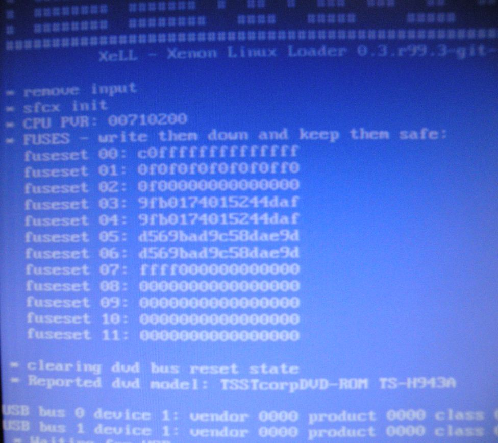
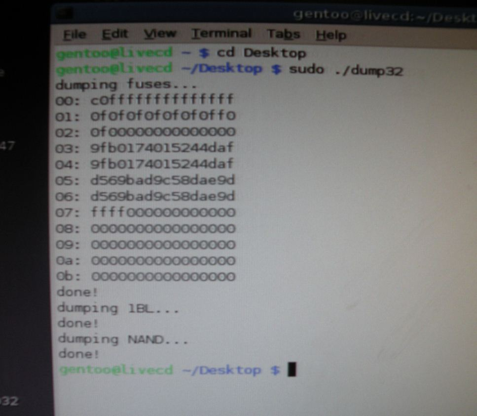

# Understanding the Xbox 360's Fusesets

The Xbox 360's Xenon CPU has 768 bits of eFUSE, a technology invented by
IBM, and implemented in some of it's processors. eFUSEs are hardware
fuses on the CPU, and can be "blown" to a binary value (1 being blown,
and 0 being un-blown) in the Xbox 360, there are 768 fuses, that make up
the fusesets. Though each fuseset can be blown individually, they are
blown in groups of 8 to make a hexadecimal value for the CPU key, and
fuseline 00, instead of a binary value, which is what XeLL will actually
display. Technically, there are only 192 viewable fuses.

## What They Look Like




**Once you aquire the fusesets (From either XeLL or dump32 in Linux)
they look like this:**

```
fuseset 00: C0FFFFFFFFFFFFFF
fuseset 01: 0F0F0F0F0F0F0FF0
fuseset 02: 0F00000000000000
fuseset 03: 9FB0174015744DAF
fuseset 04: 9FB0174015744DAF
fuseset 05: D569BAD6958DAE9D
fuseset 06: D569BAD6958DAE9D
fuseset 07: FFFF000000000000
fuseset 08: 0000000000000000
fuseset 09: 0000000000000000
fuseset 10: 0000000000000000
fuseset 11: 0000000000000000
```

## Their Real Binary Values

**If you were actually reading the fuses, they would look like this (0
being an un-burned fuse, and 1 being a burned fuse) There should be 768
ones and zeros here, hence the "768 Bits" of eFUSE. This doesn't mean
anything, but is just to show how the eFUSE's are actually set up.**

```
Fuseset 00: 1100011111111111111
Fuseset 01: 0101010101010110
Fuseset 02: 0100000000000000
Fuseset 03: 1001111110110000000101110100000000010101011101000101000000000000
Fuseset 04: 1001111110110000000101110100000000010101011101000101000000000000
Fuseset 05: 1101010101101001101110101101011010010101100011011011000000000000
Fuseset 06: 1101010101101001101110101101011010010101100011011011000000000000
Fuseset 07: 1111000000000000
Fuseset 08: 0000000000000000
Fuseset 09: 0000000000000000
Fuseset 10: 0000000000000000
Fuseset 11: 0000000000000000
```

## Fusesets 00 and 01

These are burned at the factory, after the console is manufactured, they
show whether the console is a devkit or not. They also disable CPU JTAG
after the console's flash is programed.

```
Retail fuseset 01: 0F0F0F0F0F0F0FF0
Devkit fuseset 01: 0F0F0F0F0F0F0F0F
```

## Fuseset 02

This is the lockdown counter for the 2BL/CB (The 2nd Bootloader, stored
in NAND Flash) One of these are burned everytime the console updates
it's bootloader (Which isn't very often) this is the reason that there
is no way to recover a JTAG that has been updated to 2.0.8\*\*\*.0, even
is you have the CPU key, (2BL is encrypted with the CPU/1BL key, but is
signed with Microsoft's private key so you can't change the lockdown
counter in the NAND. The bootloader will fail signature checks, and
panic)

## Fusesets 03-06

These make up the CPU key. These start out as all zero's, and are burned
presumably at random when the console boots for the first time, they are
used to encrypt the keyvault, and the bootloader sections. The CPU key
is unique to each console, and is sometimes refered to as the "per-box
key" To find the CPU key, add fusesets 03, and 05, **OR** 04 and 06. For
example, this console's CPU key would be
`9FB0174015744DAFD569BAD6958DAE9D`.

## Fusesets 07-11

These make up the console's "Lockdown Counter." They are blown after
each dashboard update starting with the update from 4532/4548 to 4598.
They prevent a previous version of the dashboard from being run on an
updated console. There are enough eFUSEs in this section for Microsoft
to update the console roughly 80 times. The lockdown counter of this
console is at FFFF00000..., this means that it has received 4 dashboard
updates since 2.0.4548.0 ran on it. Microsoft originally intended to
only blow an eFUSE when a system update patched a critical vulnerability
(Like the Hypervisor vulnerability in 4532 and 4548) but has now decided
to blow an eFUSE with every update since the update to 4598. In the
NAND's 6BL(CF) section, there is another lockdown counter that
should(Under normal circumstances) match the fuselines on the CPU. If it
doesn't match, the console will panic on boot, and will show a RRoD.
Now, here's the good part\! If we know the CPU key of the console, we
can decrypt the 6BL, and change the lockdown counter in the NAND to
match the one on the console, and therefore run an older dashboard.
Since the 6BL isn't signed with Microsoft's private key, we can edit it
as we please, so long as we have our CPU key.

# Dumping the fusesets

This is how the bootloaders do it

```c
QWORD getFuseline(DWORD fuse)
{
    if ((fuse * 0x40) < 0x300)
        return *(QWORD*)0x8000020000020000ULL + ((fuse * 0x40) << 3);
    return 0;
}

void DumpFuses()
{
    QWORD fuses[12] = { 0 };

    printf("Fuses:\n");
    for (int i = 0; i < 12; i++)
    {
        fuses[i] = getFuseline(i);
        printf("Fuse [%02d]: %016llX\n", i, fuses[i]);
    }
}
```

[Category:Xbox360 System Software](../Category_Xbox360_System_Software)
[Category:Xbox360_Hardware](../Category_Xbox360_Hardware)