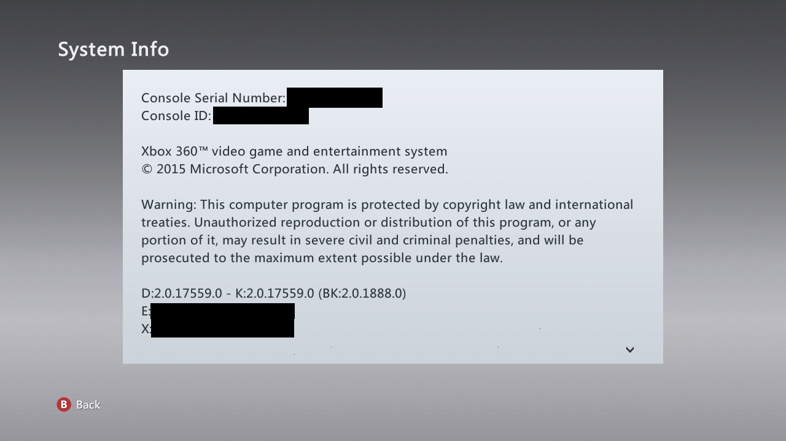
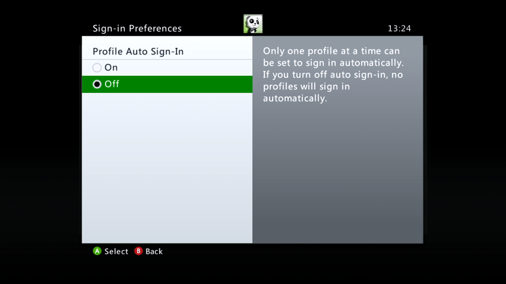
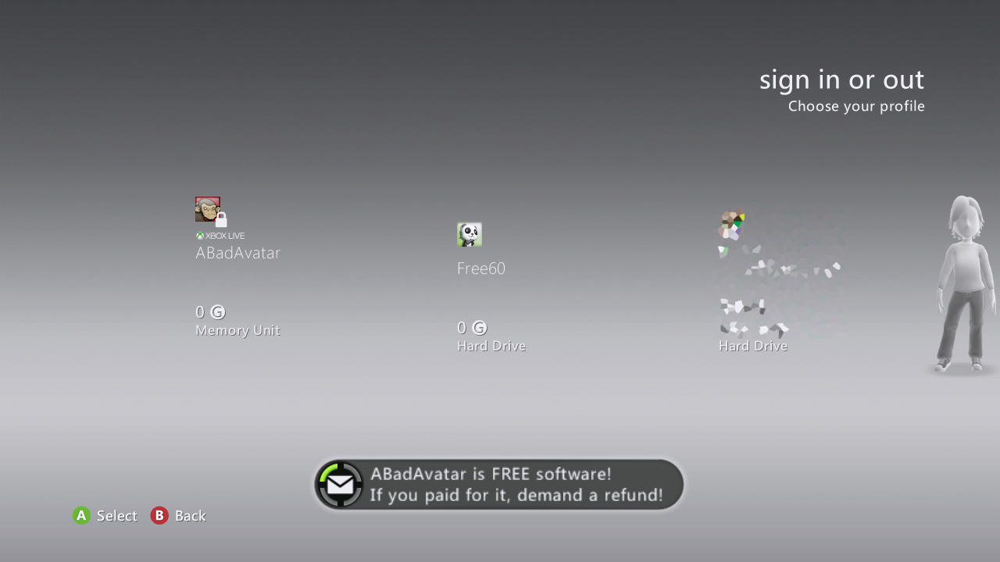
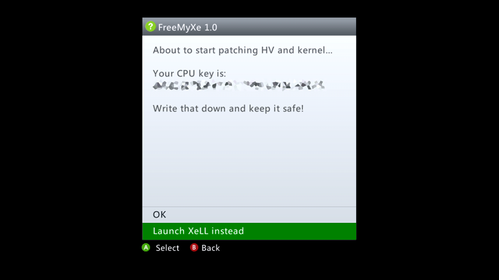
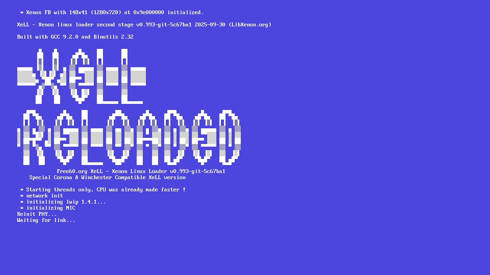

# Bad Update Hack

In Feburary 2025, Grimdoomer released the [Xbox360BadUpdate](https://github.com/Grimdoomer/Xbox360BadUpdate)
hypervisor exploit, which allows for running unsigned code on any Xbox 360
model on the 17559 dashboard version - the latest as of 1st October 2025,
released on 12th November 2019 - using entirely software-based entrypoints.

Several save game exploits can be used to launch the Bad Update exploit:

* **Tony Hawk's American Wasteland** via Tony Hawk's Pro Strcpy.

* **Rock Band Blitz** via DaTArrest.

* **Xbox 360 Dashboard** via ABadAvatar - the guide will be using this exploit.

This guide will show you how to launch XeLL Reloaded and other LibXenon homebrew.

## What you need

* An Xbox 360 running dashboard 2.0.17559.0.

* A FAT32 formatted USB drive.

* The latest version of [ABadAvatar](https://github.com/shutterbug2000/ABadAvatar/releases).

* The latest version of [FreeMyXe](https://github.com/FreeMyXe/FreeMyXe/releases).

## Preparation steps

1. Ensure your console is on dashboard version 2.0.17559.0.
   

2. If enabled, disable automatic profile sign-in for your profile.
   

3. Disconnect from Wi-Fi on your console, or unplug the Ethernet cable.

## Copying files

1. Extract the contents of the ABadAvatar ZIP file to the root of your USB
   drive. There should be a "BadUpdatePayload" folder and a "Content" folder.

2. Extract the contents of the FreeMyXe ZIP file to the BadUpdatePayload folder
   on your USB drive.

3. Delete any existing "default.xex" in the BadUpdatePayload folder, and rename
   "FreeMyXe.xex" to "default.xex".

## Running the exploit

1. Turn off your console, then plug in your USB and turn it on again.

2. At the dashboard, you should see a notice from ABadAvatar and the exploit
   will start running.
   

3. Within 2 minutes, your Xbox should show you a prompt from FreeMyXe. If you
   don't get a prompt or your console freezes, power off the console and try
   again.
   

4. Select "Launch XeLL instead" and XeLL Reloaded will launch.
   

5. It is safe to re-connect an Ethernet cable once XeLL has launched.
