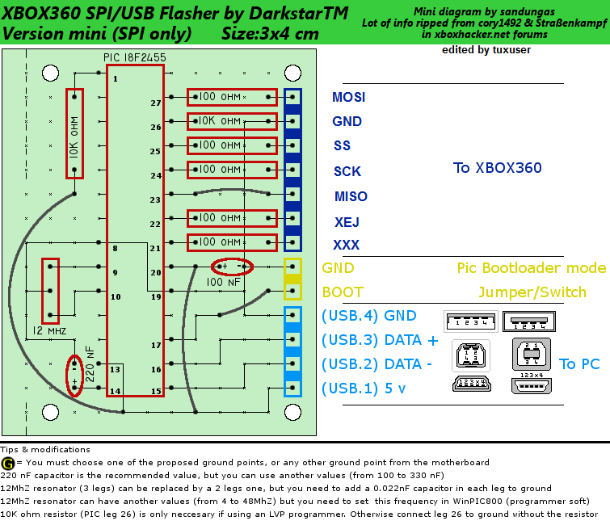

# General

To communicate with the Flash Controller you need a device which
is capable of the [Xbox 360's SPI Protocol](../Hardware/Console/SPI.md). There are
ready-to-use devices you can buy or, if you aren't afraid of soldering
your own hardware, DIY homebrew devices. Basically: Get the device
programmed (if needed) and solder it according to the
[Diagram](../Hardware/Console/SPI.md) to your Xbox's mainboard - you can start
reading/writing to your NAND after installing the needed drivers.

# DIY / Homebrew

## LPT SPI Programmer

This type of programmer isn't really recommended as it's awfully slow
and can probably cause high failure rates.

Description coming later...

## USB SPI Programmer

Needed material:

  - 1x 50X100 PCB
  - 1x 12 MHz Resonator
  - 1x 220nF Capacitor
  - 1x 100nF Capacitor
  - 1x 10 kOhm Resistor
  - 6x 100 Ohm Resistor
  - 1x 1 Row x 10 Pin - 2,54mm Pin Headers (male)
  - 1x 1 Row x 10 Pin - 2,54mm Pin Headers (female)
  - 1x PIC 18F2455-I/SP
  - 1x USB Conector (female)
  - 1x Matching USB Cable
  - Wire

Program the PIC with your favorite PIC Programmer (Can be build or
bought - for building one yourself the "ART2003" is recommended) with
the latest "Picflash" HEX file.

## LPC2148

Description coming later...

## AT90USB162 Programmer

Description coming later...

# Ready to use

There are several ready-to-use professional products like: Team Xecuter
NAND-X, Maximus 360NandFlasher, Matrix SPI Programmer etc. They arrive
preprogrammed and can be used directly with Software like
[NANDPro](../Homebrew/PC-Software/NANDPro.md) to interact with the NAND Flash.
