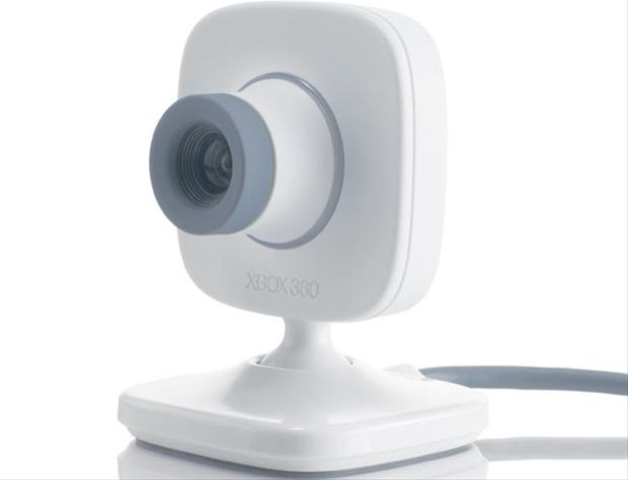

# Xbox Live Vision Camera

The web cam, also known as Xbox Vision Cam, that you can buy separate
from the xbox 360 is just a little web cam that you can twist and move
yourself. You can send picture messages with it, have video chats and a
few other little things like having the background warping appropriate
to your movement in front of the vision cam. The quality isn't amazing
but it suits the purpose of what the device is used for which is just
simple things like video chatting and picture messaging. When video
chatting audio is heard through the microphone. They aren't as popular
as they used to be probably because of the Kinect having all of these
features and much more built in.

[Category: Hardware](../index.md)
