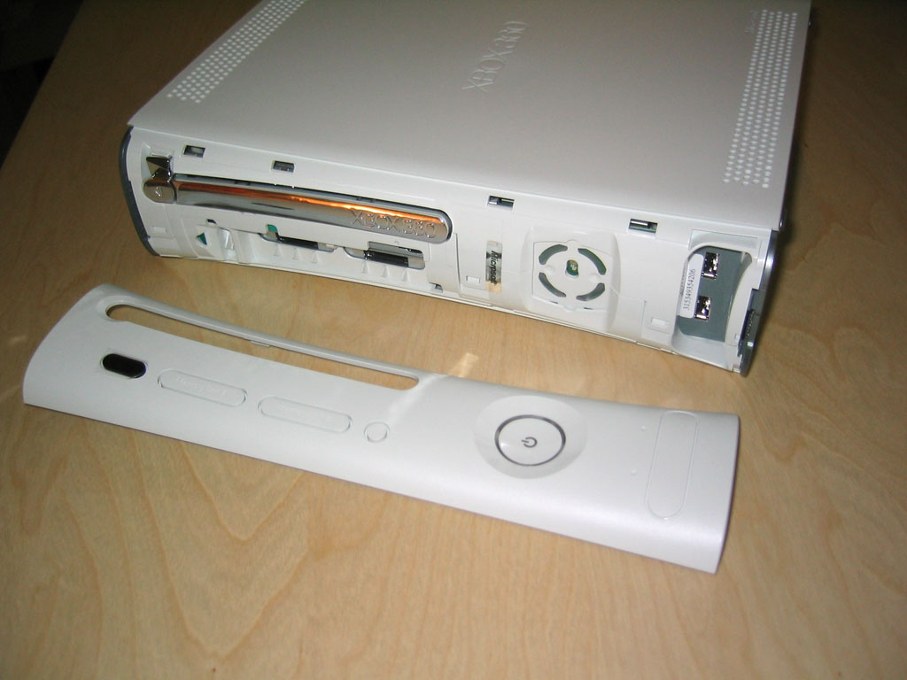
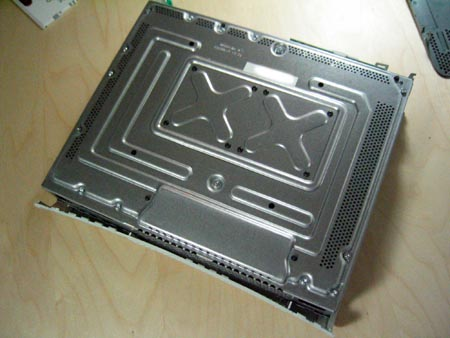
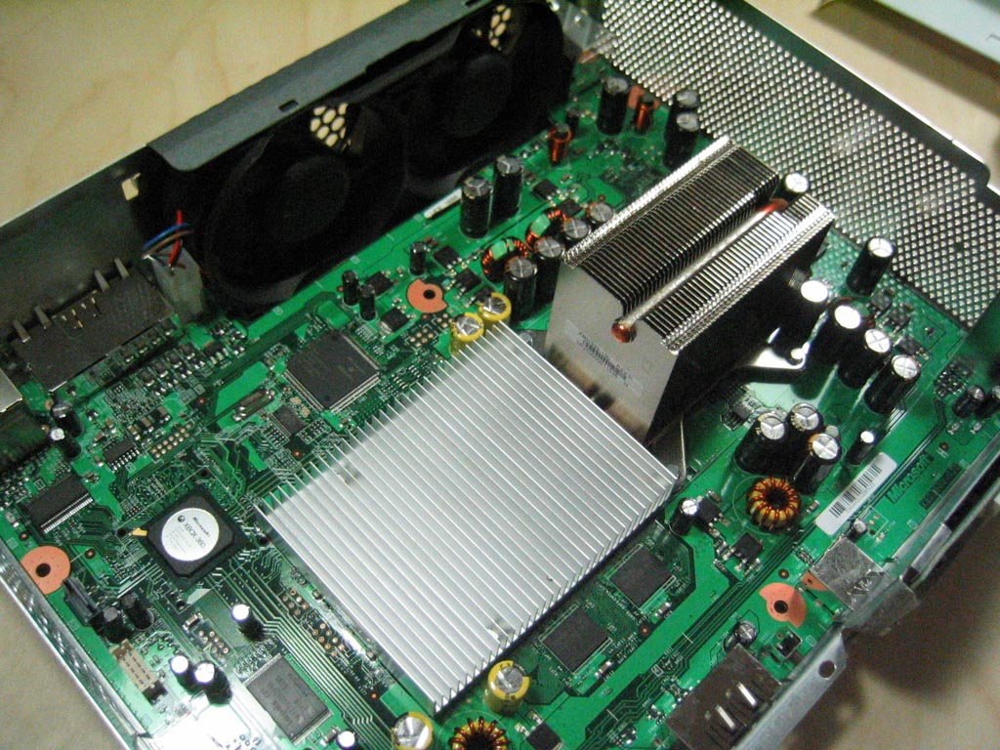

# Case

The Xbox 360 **Case** is made of plastic and was originally made to be
hard to open. However it can easy be removed :

- Remove the HDD
- Remove the Face Plate by inserting your Right thumbs into it and
  forcing it a bit upwards

You need to remove this panel before lifting the front panel•Then remove
both side pannels by inserting a small iron tool into the holes, and
popping out the place holders

- Slowly lift up the Front panel, by unlocking the 4 plastic placesholders about 4cm
- Then insert a small tool in each hole of the backplate and open up the back side

You now can lift up the upper part of the casing

To remove the border case, Remove 6 large screws from the down panel
with a torx T10 screw driver.

[Category: Hardware](../index.md)
