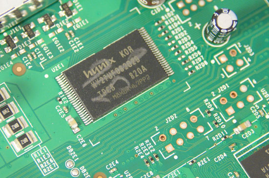
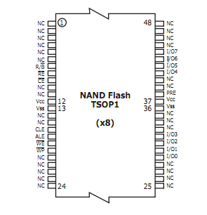
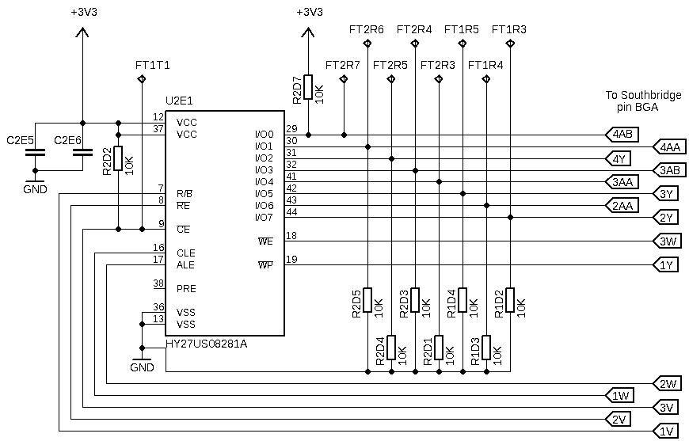
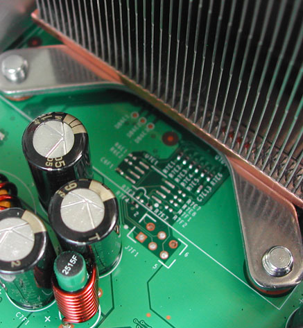
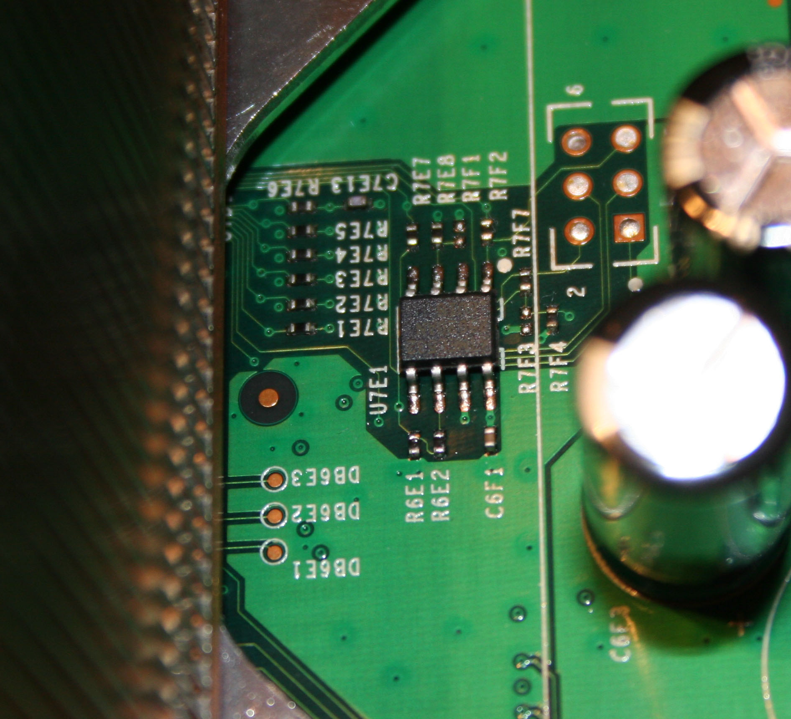

# NAND



## Flash memory



- [Datasheet](https://web.archive.org/web/20150112073857/http://www.hynix.com/datasheet/pdf/flash/HY27US(08_16)281A%20Series(Rev0.6).pdf)


- SMT socket that should work if you choose to remove yours:
  https://web.archive.org/web/20111206034431/http://www.emulation.com:80/cgi-cfm/insert_quantity.cfm?part_number=S%2DTSO%2DSM%2D048%2DA

Attached to [Southbridge](./Southbridge.md)

## NAND Points on Motherboard for FAT



## NAND Points on Motherboard for SLIM

coming soon...

## Different Sizes

On different Motherboard Revision also different NANDs were used.
[Xenon](./Xenon_(Motherboard).md)-, [Zephyr](./Revisions/Zephyr.md)-,
[Falcon](./Revisions/Falcon.md)-, [Trinity](./Revisions/Trinity.md)-, and some
[Jasper](./Revisions/Jasper.md)-Consoles (Retails) use 16MB NANDs.

Other [Jasper](./Revisions/Jasper.md)-Consoles (Retail), Arcade Bundles which
came without a HDD, got a 256MB or 512MB Big Block NAND onboard. Only 64MB of
these 256/512MB NAND are used for system files, the rest is used as an
internal FATX Memory Unit. 

All Development-/Demo-/Reviewer-/Test-Kits got at
least a 64MB NAND. Depending on the NAND Size either Small- or
Large-Block Flash Controllers get used.

## Flash Controllers

The Flash Controller decides how to handle the NAND Memory. There are
currently two types, the Old/Original SFC which handles the NAND with
small block and the new SFC (Codename: Panda?) which handles the NAND as
either small or large blocks.

**Original SFC (pre-Jasper)**

  - 16MB NAND

| Type                            | Size                   |
| ------------------------------- | ---------------------- |
| Block Size                      | 0x4000 (16KB)          |
| Block Count                     | 0x400                  |
| Page Size                       | 0x200                  |
| Pages per Block                 | Block size / Page size |
| Raw Page Size (incl. SpareData) | 0x210                  |
| Usable Filesystem-Size          | 0x3E0                  |

  - 64MB NAND

| Type                            | Size                   |
| ------------------------------- | ---------------------- |
| Block Size                      | 0x4000 (16KB)          |
| Block Count                     | 0x1000                 |
| Page Size                       | 0x200                  |
| Pages per Block                 | Block size / Page size |
| Raw Page Size (incl. SpareData) | 0x210                  |
| Usable Filesystem-Size          | 0xF80                  |

**New SFC**

  - Small Block: 16MB NAND

| Type                            | Size                   |
| ------------------------------- | ---------------------- |
| Block Size                      | 0x4000 (16KB)          |
| Block Count                     | 0x400                  |
| Page Size                       | 0x200                  |
| Pages per Block                 | Block size / Page size |
| Raw Page Size (incl. SpareData) | 0x210                  |
| Usable Filesystem-Size          | 0x3E0                  |

  - Large Block: 256/512MB NAND

| Type                            | Size                   |
| ------------------------------- | ---------------------- |
| Block Size                      | 0x20000 (128KB)        |
| Block Count (non-MU)            | 0x1000                 |
| Page Size                       | 0x200                  |
| Pages per Block                 | Block size / Page size |
| Raw Page Size (incl. SpareData) | 0x210                  |
| Usable Filesystem-Size          | 0x1E0                  |

## Simple Calculations

Have an address which is without ECC?

`realaddr = (addr / 512) * 528 + (realaddr % (mod) 512 > 0 ? realaddr % (mod) 512 : 0);`

This also works in reverse:

`addr = (realaddr / 528) * 512 + (realaddr % (mod) 528 > 0 ? realaddr % (mod) 528 : 0);`

## Reading/Writing

The Flash can be written or read using a number of methods.

- If you are on a retail flash, the easiest is using a [SPI Programmer](../NAND/SPI_Programmer.md)

- If you have the old KK hack, the easiest is using [lflash](../../Linux/Lflash.md).

- If you are on RGH / JTAG, the easiest is using [XeLL-Reloaded](../../Homebrew/Tools/XeLL.md)

In software the NAND is mapped to memory address 0x80000200C8000000.

  - You must be in real-mode to access the space
  - You can read it byte by byte but it is recommended to follow the
    standard and read it in 4 byte blocks

## Sectors

  - 1: copyright notice, zeros, unencrypted numbers
  - 2: encrypted data

@2MB filesystem, unencrypted, but content encrypted, config not

## NAND File System

Informations about the Filesystem on the Xbox 360 NAND Flash can be found
[here](../../System-Software/NAND/Image.md)

## Bad Blocks

Its possible that bad blocks appears when reading/writing to the NAND.
For solving these look at the following page: [Bad Blocks](../NAND/Bad_Blocks.md)

## Small flash chip close to CPU

Some 360s have a small flash chip near the CPU, some don't as seen in
the following pictures.

No chip:



Here is a high-res picture of a premium box with the chip:



As discussed in this article on the xboxhacker.net forums, this appears
to be a Atmel 25020 EEPROM. The chip model reads:

```
ATMEL524
25020AN
SU18
```

Datasheet can be found
[here](https://web.archive.org/web/20061005163428/http://www.atmel.com/dyn/resources/prod_documents/doc3348.pdf).

This chip is a low power 2048 bit serial EEPROM according to the
datasheet.

- If the small chip near the CPU is removed the Xbox will boot up and
  function just fine \[Darkmoon 360 experiments\]

- According to IBM the CPU has "An interface for a serial EEPROM in
  case patch logic configuration was needed during bring-up"

## Small flash chip on front panel

There is another Atmel chip on the front panel:

 <!-- This image (Atmel2.jpg) has never actually appeard on the wiki archive. A new image can be taken by anyone with the correct hardware. -->

Atmel 528 serial EEPROM

This chip reads:

```
ATMEL528
24C04N
SU18
```

Datasheet can be found
[here](https://web.archive.org/web/20061224151351/http://www.atmel.com/dyn/resources/prod_documents/doc0180.pdf)

This chip is a low power 4096 bit serial EEPROM according to the
datasheet.

## Tools

- [J-Runner with Extras](https://github.com/J-Runner-With-Extras/J-Runner-with-Extras), AIO NAND Builder and Flasher
- 360 Flash Tool, which is not easy to find
<!--- [Xbox 360 NAND Editor](http://www.megaupload.com/?d=LGF518J0) by stoker25, open source and semi-complete, has code to do with bootloaders/keyvault/filesystem -->

[Category: Hardware](../../index.md)

[Category: Pages That Need Updating](../../%21Pages_That_Need_Updates.md)