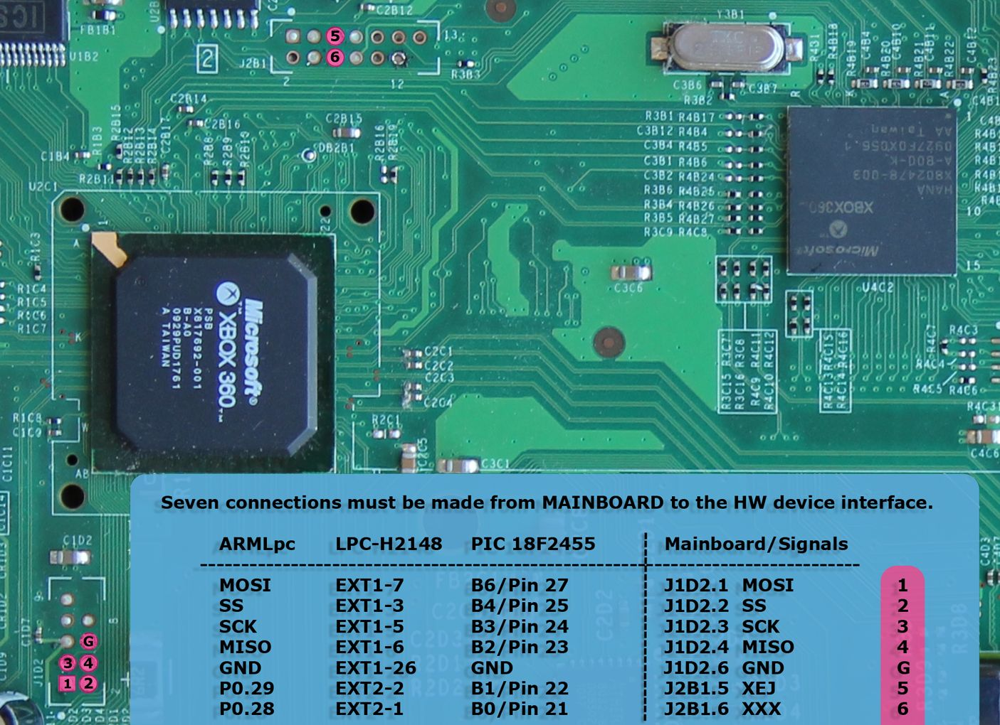
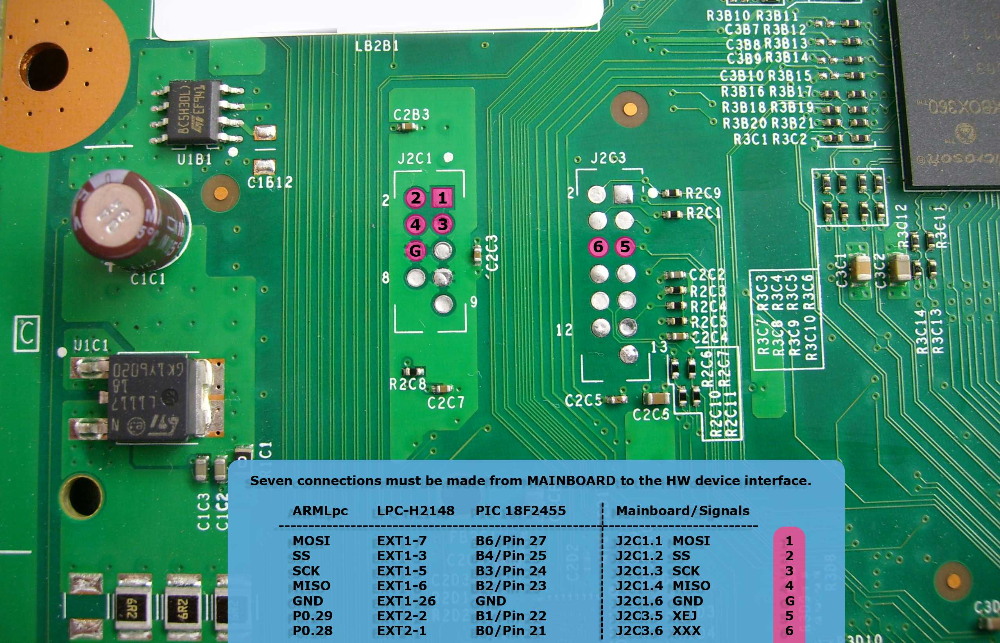

# General

The SPI bus (Serial Peripheral Interface) on the Xbox 360 is mainly used
for communicating with the [NAND-Flash Controller (SFCX)](../../System-Software/SFCX.md),
an [SPI Programmer](../../Hacks/SPI_Programmer.md) is needed for this. The bus
consists of the following signals:

| Name | Description          |
| ---- | -------------------- |
| MOSI | Master out, Slave in |
| SS   | Slave Select         |
| SCK  | Serial Clock         |
| MISO | Master in, Slave out |
| XEJ  | Eject                |
| XXX  | ?                    |
|  |

# FAT Motherboard

The Diagram matches following Xbox 360 Motherboard-revisions:
[Xenon](./Xenon_(Motherboard).md), [Zephyr](./Revisions/Zephyr.md),
[Falcon](./Revisions/Falcon.md), [Opus](./Revisions/Falcon.md#Opus),
[Jasper](./Revisions/Jasper.md).

# SLIM Motherboard

The Diagram can be used for Xbox 360 Motherboard-revision:
[Trinity](./Revisions/Trinity.md)

