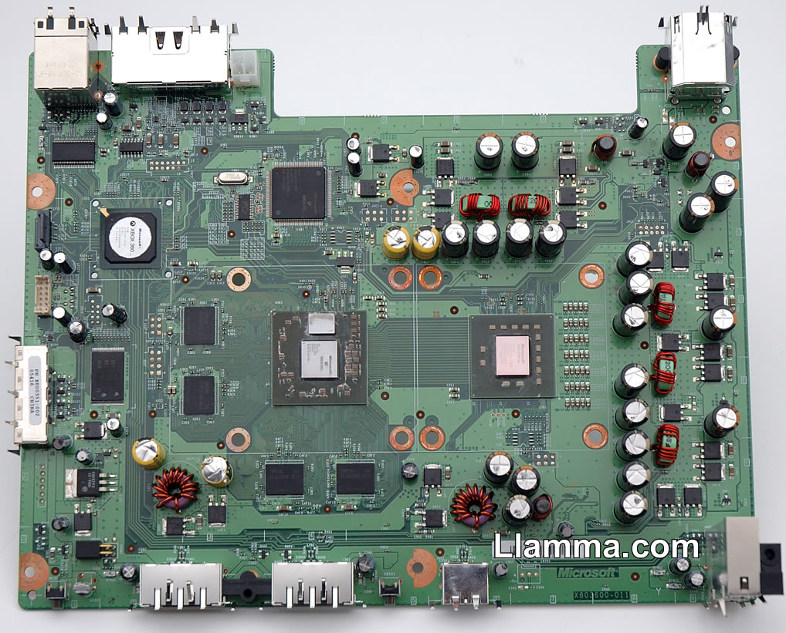

The original Xbox 360 configuration used in the initial Premium and Core
machines released in the end of November 2005.
These are also know as the RRoD (Red Ring of Death) machines because the
GPU chip warps away from the motherboard because of excessive heat.

  - 90 nm IBM CPU
  - 90 nm ATI GPU and 90nm on-chip eDRAM
  - Low profile GPU cooler
  - Standard CPU cooler
  - 203 Watt output power supply (16.5 A)
  - Shipping with Hitachi and Samsung DVD-Drive
  - Highly unlikely to have glue around the CPU but it IS possible.

[Category: Hardware](/Hardware)
