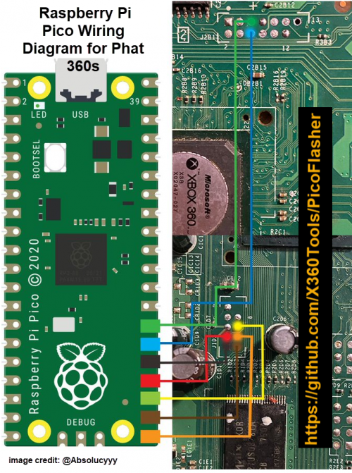
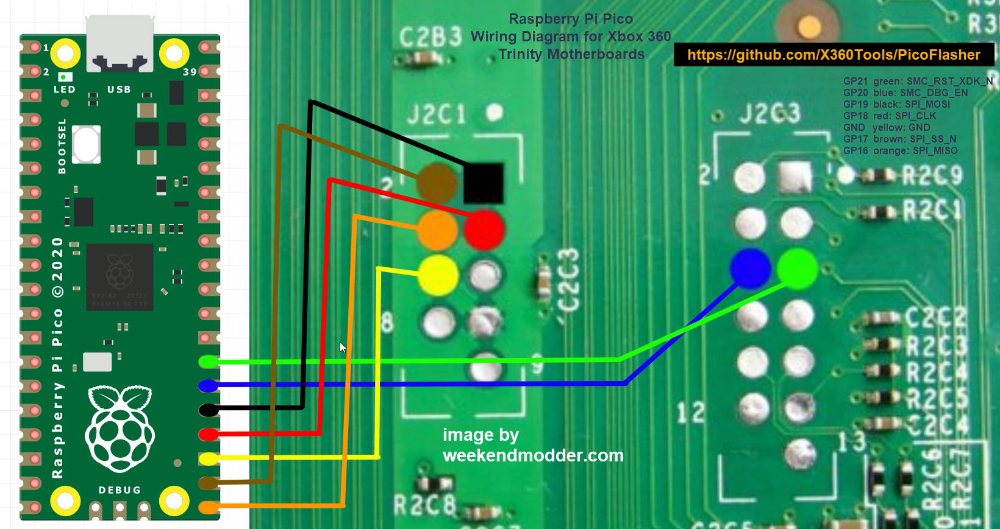
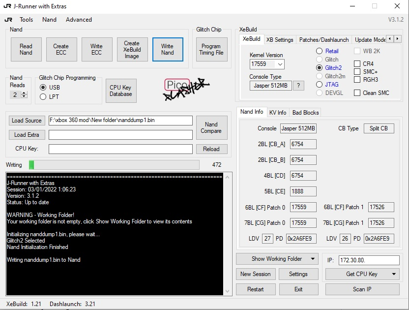

# PicoFlasher v4

Needed material:

  - 1x Raspberry Pi Pico
  - 1x Micro-USB to USB-A Cable
  - Wire

Program the Pico with the latest [PicoFlasher](https://codeberg.org/hax360/PicoFlasher) firmware.

| Pico  | Xbox           |
| ----- | -------------- |
| GP16  | SPI_MISO       |
| GP17  | SPI_SS_N       |
| GP18  | SPI_CLK        |
| GP19  | SPI_MOSI       |
| GP20  | SMC_DBG_EN     |
| GP21  | SMC_RST_XDK_N  |
| GND   | GND            |

## Software

PicoFlasher works natively on Windows via J-Runner-with-Extras. After programming with the latest firmware
and soldering in the headers to your Xbox 360, connect your PicoFlasher to your PC and start J-Runner.

If succesfully connected, a PicoFlasher logo will appear on the main page.

Simply click "Read NAND" to read, and "Write NAND" to write.