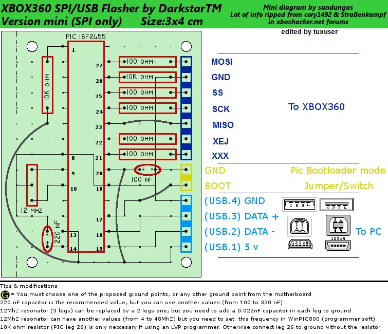

# DIY / Homebrew SPI Programmer

Needed material:

  - 1x 50X100 PCB
  - 1x 12 MHz Resonator
  - 1x 220nF Capacitor
  - 1x 100nF Capacitor
  - 1x 10 kOhm Resistor
  - 6x 100 Ohm Resistor
  - 1x 1 Row x 10 Pin - 2,54mm Pin Headers (male)
  - 1x 1 Row x 10 Pin - 2,54mm Pin Headers (female)
  - 1x PIC 18F2455-I/SP
  - 1x USB Conector (female)
  - 1x Matching USB Cable
  - Wire

Program the PIC with your favorite PIC Programmer (Can be build or
bought - for building one yourself the "ART2003" is recommended) with
the latest "Picflash" HEX file.
