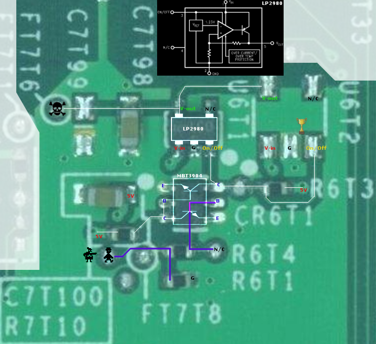
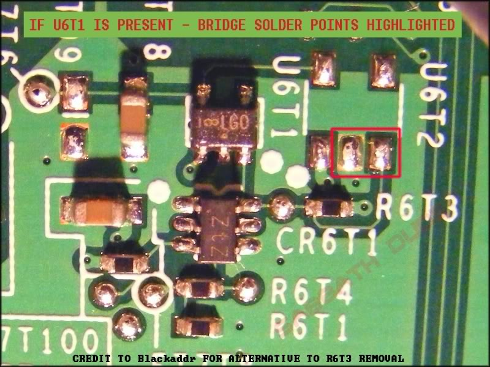
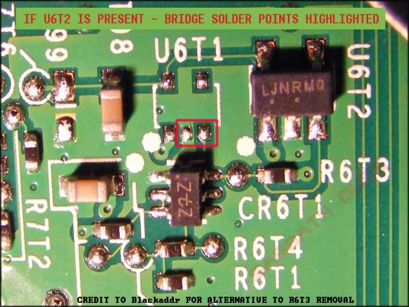
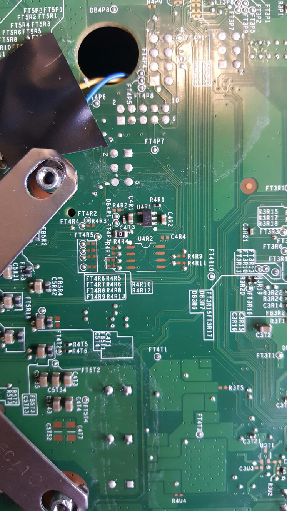

**R6T3** is the label of a resistor on the mainboard of the Xbox 360, it
supplies the necessary voltage for the [Xenon (CPU)](Xenon_(CPU)) to burn the so-called **eFuses**.
Burned **eFuses** prevent older firmwares (any older rev. than 4552)
from running on your Xbox 360, thus eliminating the possibility to
downgrade to an earlier version of the kernel.
The Resistor itself is located in the field T-6. It is a 10k Ohm (10,000Ohm)
SMT resistor (Case 0402) functioning as part of a current limiting circuit.

The eFuse circuit uses a dual BJT array part
[MBT3904](http://www.datasheetcatalog.org/datasheet/lrc/MBT3904DW1T1.pdf).
The datasheet says:

Q1 has

  - Pin 3 - collector
  - Pin 4 - emmiter
  - PIn 5 - base

Q2 has

  - Pin 1 - emmiter
  - Pin 2 - base
  - PIn 6 - collector

From looking at the board traces, R6T3 is the collector resistor to
Q2.
The collector pin enables the LDO that provides the voltage for the
eFuse burning.
The base of Q2 is tied to the collector of Q1.
When Q2 is on, the voltage at the collector is logic LO and the LDO is
disabled (logic LO at the enable pin).
Q2 turns on when the base is logic HI, which means Q1 must be off, so
the voltage will pull high through the Q1 collector resistor.

## Important Note

  - The removal of R6T3 will cause an E80 system error if the NXE update
    is installed.
  - Replacing the resistor with the original or with another 10K Ohm
    resistor usually fixes the error state.
  - Given the difficulty in surface mounting a resistor as small as
    R6T3, simply holding a 10K Ohm in place while the 360 is powering up
    after giving a E80 will typically allow normal operation from then
    on.
  - Care must be taken not to bridge the gap without a resistor in place
    as this may cause system damage.

## Alternative to Removing R6T3

For people who find removing R6T3 too difficult can follow one of the
two solution:

if U6T1 is present

if U6T2 is present

Shorting pin 6 to pin 1 (C to E) of the transistor pack, or pin 6 (C) to
any convenient ground. Thats only one jumper, ena pin cant go hi, since
its grounded.

## External Links

  - [Just discussing possible alternatives to removing R6T3](https://web.archive.org/web/20100213101317/http://www.xboxhacker.org/index.php?topic=13658.0) at XboxHacker
  - [HIGH RES R6T3 IMAGE](http://www.360mods.net/modules/coppermine/albums/userpics/efuse/r6t3.jpg)

# Slim Version

The slim version of R6T3 on the trinity motherboard is R4R1. It is
located right next to the x-clamp on the bottom of the motherboard. Some
people have reported removing the resistor will not throw an error on
startup, but will throw an error if the console tries to update.

[Category: Hardware](/Hardware)
