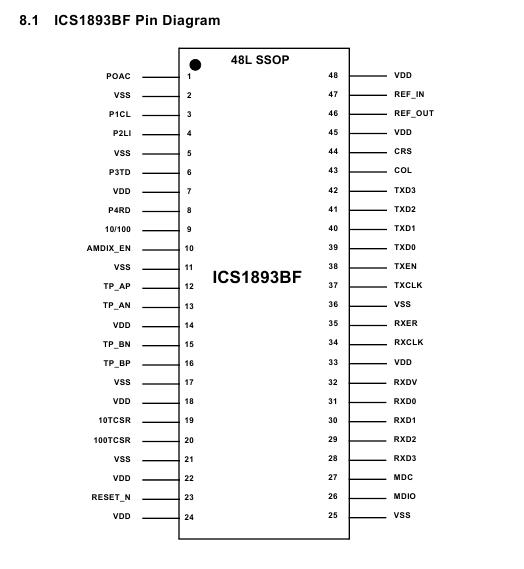
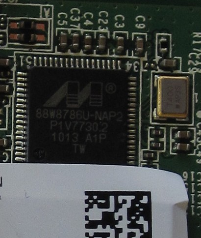
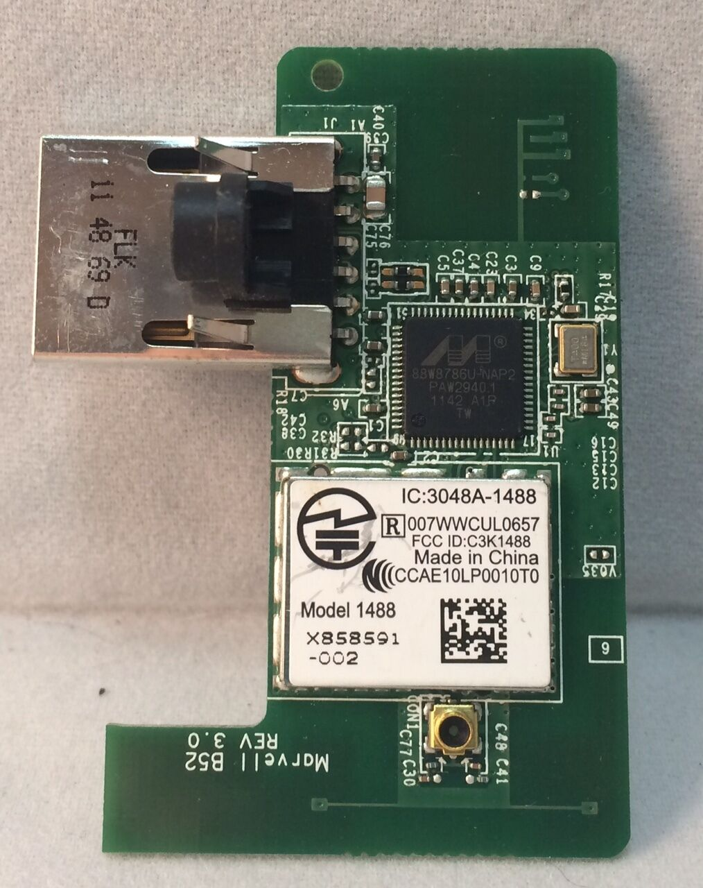
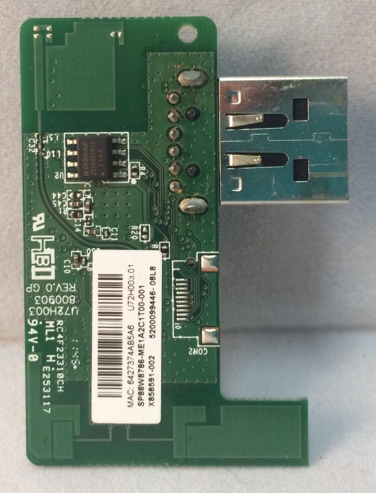
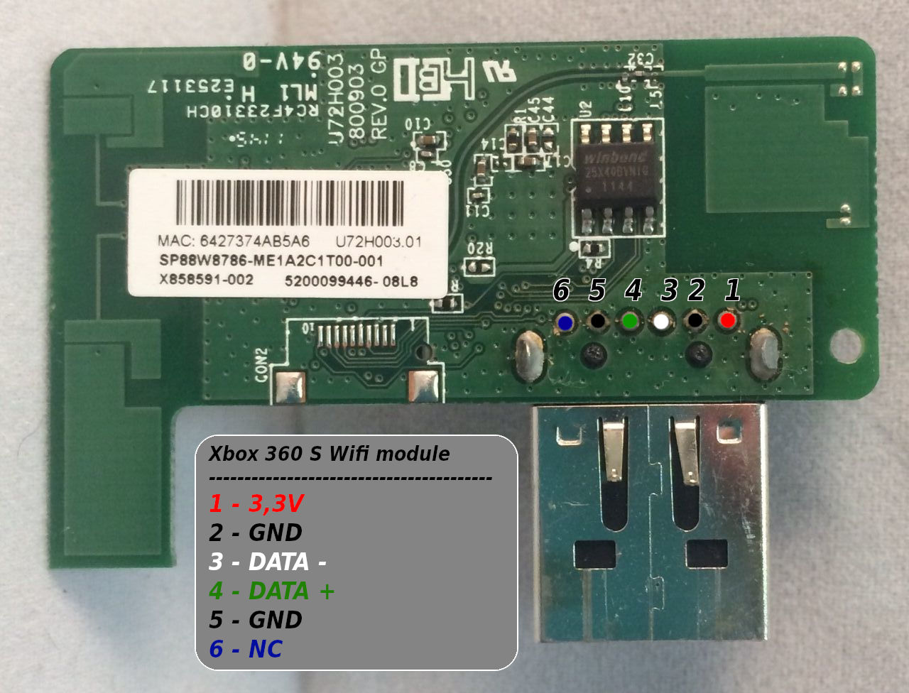

# Ethernet interface

The Xbox 360 use all the same Ethernet 10/100 network adapter.
WiFi-adapter is missing, but can be purchased separately. For new
revisions of consoles (Slim version) Wi-Fi-built module.

Controller chip Fast Ethernet (on-board is usually referred to as U1B1 or U1B2)

## Ethernet Chip

### ICS1893BF

[Datasheet](https://www.idt.com/document/dst/1893bfbk-datasheet)

Comes from Integrated Circuit Systems, Inc.

### BCM5241

[Datasheet](https://docs.broadcom.com/docs/12358209)

Comes from Integrated Circuit Systems, Inc.

Pinout coming soon...

## WLAN Chip

### Xbox 360 Slim - Internal Wifi module

The Xbox 360 Slim family (Corona/Trinity/Winchester) comes with an internal wifi module.

It is connected to the motherboard via USB protocol, it uses 3,3V VCC instead of 5V!

Generic info:

- Wifi Chipset: Marvell 88W8786U-NAP2
- Flash: Winbond W25X40BVSNIG (4Mbit / 512kB)
- USB IDs: 045e:0765

There are different models of this board used:

- Model 1400, X850272-007, U72H003 GP 800571 REV.0, FCC: C3K1400
- Model 1488, X858591-002, Marvell B52 REV 3.0, FCC: C3K1488

[Category: Xbox 360 Hardware](../Category_Xbox360_Hardware)
